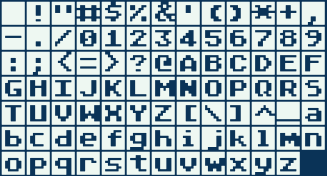
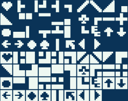
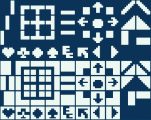

# ATASCII
### Sublime Text Plugin for ATASCII Unicode

Use this in conjunction with [AtariTools](//github.com/thinkyhead/6502-Tools/tree/master/Sublime/AtariTools) to edit AtariBASIC the modern way. Requires [Atari Classic](//members.bitstream.net/marksim/atarimac/fonts.html) Font.

#### Insert Character

Press <kbd>Ctrl+Shift+A</kbd> <kbd>Ctrl+Shift+A</kbd> to open popup panel with ATASCII Inverted Characters. Click to insert a character.

Press <kbd>Ctrl+Shift+A</kbd> <kbd>Ctrl+Shift+S</kbd> to open popup panel with ATASCII Special Characters. Click to insert a character.

Press <kbd>Ctrl+Shift+A</kbd> <kbd>Ctrl+Shift+D</kbd> to open popup panel with ATASCII Draw Characters. Click to insert a character.

#### Invert Selected Text

Press <kbd>Ctrl+Shift+A</kbd> <kbd>Ctrl+Shift+I</kbd> to invert the selected text, replacing all normal characters with inverted characters and _vice-versa_.
